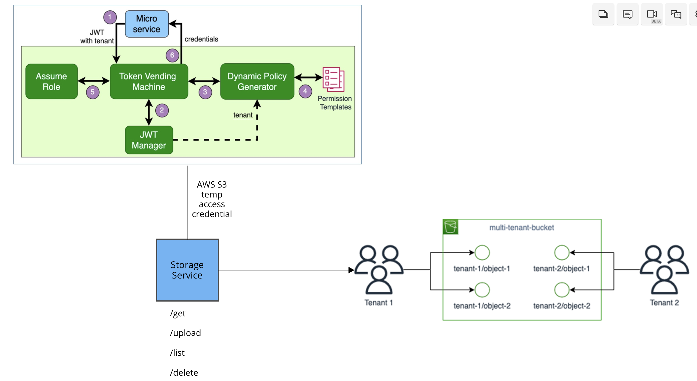

# Golang API Server for Multi-Tenant AWS S3 Interaction

## Overview

This Golang API Server is designed to provide secure multi-tenant AWS S3 interaction for SaaS platforms. It employs a token vendor machine concept to ensure robust security and isolation of customer data.

## Architecture

## Features

- **Multi-Tenant Isolation**: The API server ensures strong isolation between different tenants, guaranteeing the security and privacy of customer data.

- **Token Vendor Machine**: A token vendor machine is utilized to generate and manage tokens. These tokens are crucial for authentication, authorization, and ensuring that each tenant's data is isolated.

- **AWS S3 Integration**: Seamless integration with the AWS S3 service, allowing tenants to securely store and retrieve their data.

- **Scalability**: The architecture is designed to be highly scalable, accommodating a growing number of tenants and increasing workloads for SaaS applications.

## Owner

<table>
  <tr>
    <td align="center"><a href="https://github.com/anthoai97"> <b>An Thoai</b></a> </td>
    </tr>
</table>

## License

This project is licensed under the terms of the MIT license.